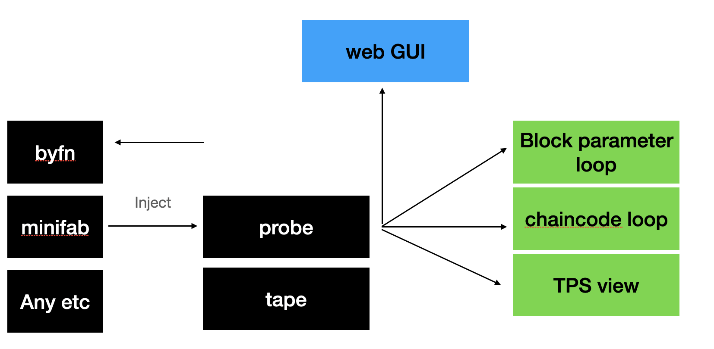
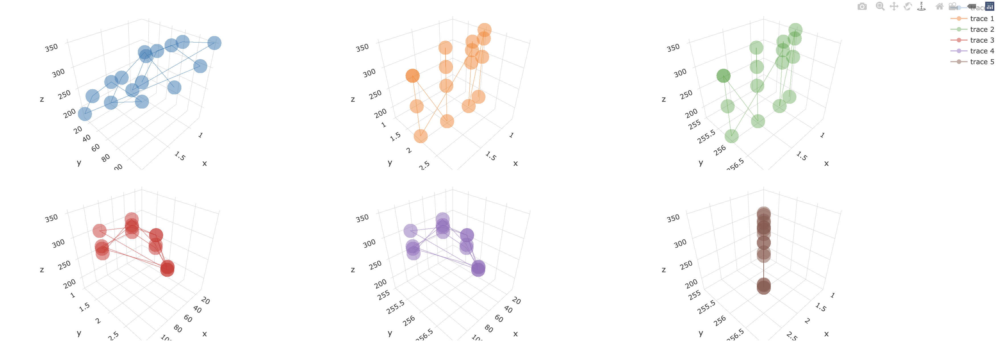

# Probe
ci test
## What is Probe

Probe is a web GUI application with for Hyperledger Fabric mantianer, user, research to find the best block config logic for my chaincode.

- Probe provides loop test control for given block parameter arrays.
- Probe provides sample chaincode for some test cases.
- Probe provides TPS result review as below:

for each graph from output, label as below

| x         | y             | z         | 
|---------  |------------   |---------|
| BatchTimeout      | MaxMessageCount       | tps     | 
| BatchTimeout      | AbsoluteMaxBytes      | tps     | 
| BatchTimeout      | PreferredMaxBytes     | tps     | 
| MaxMessageCount   | AbsoluteMaxBytes      | tps     | 
| MaxMessageCount   | PreferredMaxBytes     | tps     | 
| AbsoluteMaxBytes  | PreferredMaxBytes     | tps     | 

## Why Probe
As TWGC performance work group, we found out that different block parameters, networks, chaicndoe language and chaincode logic having influence final TPS.

### For Fabric user
You are able to have better understanding with performance for your chaincode logic by:
1. Perpare probe for your test env.
2. Start probe with parameters.
3. Once ompleted, you will get the TPS rates with block parameters in GUI as above.

### For Fabric researcher and mantainer
You are able to know better with how your changes impacts Fabric TPS in over all view.
1. Completed your changes, and dokerize your Fabric.
2. Start probe with parameters.
3. Once completed, you will well known how your changes impacts Fabric TPS.

## Probe is not

- Real time time monitor, for real time tps monitor, pls use prometheus.
- Auto test framework for Fabric performance, as in probe, we will invoke as byfn or minifab for your network up/down/cleanup.
- Performance test tool for Fabric, for this we using tape.
- GUI for tape, tape focus on once off time performance testing.
