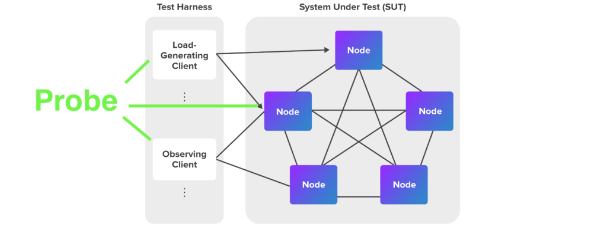
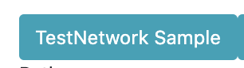

# Probe

[中文](README_ZH.MD)

## What is Probe

According to [blockchain-performance-metrics](https://www.hyperledger.org/learn/publications/blockchain-performance-metrics), Probe is a web GUI application for Hyperledger Fabric mantianer, user, research. Aims at providing a way to control both SUT and LGC to find the best block config logic for specific chaincode for specific fabric network.  Meanwhile has a better understanding of how block config impacts performance.

- Probe provides loop test control for given block parameter arrays.
- Probe provides TPS result review via GUI.
- Probe provides sample chaincode for some test cases.

## You can use Probe to ...
- [HowToConfigFabricParameters](doc/HowToConfigFabricParameters.md)

## Why Probe
As discussed with [TWGC performance work group](https://github.com/Hyperledger-TWGC/fabric-performance-wiki), we found out that different block parameters, networks, chaincode language and chaincode logic having influence final TPS.
To answer, the best parameter for specific fabric network and fabric chaincode, this project been created.

## Probe is not
- Real time time monitor, for real time tps monitor, pls use Prometheus. (But Probe has demo for it with test network [here](https://www.bilibili.com/video/BV1x54y1x78Z))
- Auto test framework for Fabric performance, as in probe, we will invoke as byfn or minifab for your network up/down/cleanup.
- Performance test tool for Fabric, for this we using tape.
- GUI for tape, tape focus on once off time performance testing.

## Quick start
1. Install this project `npm install`

1. Install fabric-sample environment

   `curl -vsS https://raw.githubusercontent.com/hyperledger/fabric/master/scripts/bootstrap.sh | bash`

   **Note**  

   If the above curl command fails, it may be that the old version of curl cannot handle redirection or cannot be redirected due to network reasons in
some countries and regions. At this time, users can download the [bootstrap.sh](https://raw.githubusercontent.com/hyperledger/fabric/master/scripts/bootstrap.sh) script then run it.

1. Get tape `docker pull guoger/tape`

1. Apply the bridge file to adjust block parameters for test network `cp sample/prepareConfig.sh fabric-samples/test-network`

1. `npm start`

1. Access localhost:3000, click 

1. Click

1. Access `localhost:3000/result/BatchTimeout` to see TPS relationship with BatchTimeout

1. Access `localhost:3000/result/MaxMessageCount` to see TPS relationship with MaxMessageCount

## Version Plan
version | define| feature
---|---|---
0.0.3 | back end refactor | i18n & minifab
1.0.0 | fix up bugs after 0.0.3 | 
1.0.1 | furhter network supports | supports caliper, cello ? and other platform

# How to contribute

If your want to contribute Probe with new feature, bug fixing please create a new issue, of course with PR is best.

Also welcome for documentatoin, learning course, etc.

For development, please complete `Quick start` above.

For Frontend, please use `npm run build`.

For backend, please develop `--DryRun` as mock for unit test and adding real cases in CI

## Video (in Chinese)
version | URL | comments
---|---|---
0.0.1 | https://www.bilibili.com/video/BV1x54y1x78Z | N/A
0.0.1 | https://www.bilibili.com/video/BV1dV411y7oZ | N/A
0.0.2 | https://www.bilibili.com/video/bv13t4y1B7AE | N/A
