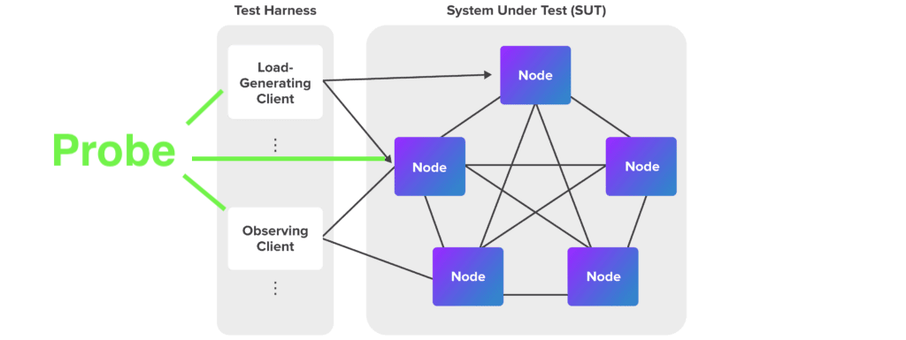

# Probe
[](https://dev.azure.com/yy19902439/yy19902439/_build/latest?definitionId=8&branchName=main)

## Probe是什么


根据[性能测试白皮书](https://www.hyperledger.org/learn/publications/blockchain-performance-metrics), Probe是一个面向Hyperledger Fabric维护者，用户，研究者的web UI的应用程序，旨在提供控制被测网络（SUT）并协调压力生成工具于观察工具，来针对性的观察Fabric出块参数对于Fabric网络性能的影响。

- 提供循环测试控制。
- 提供可视化的结果对比图。
- 提供基于test-network的配置案例。

## 可以用Probe做什么
- [如何通过Probe配置调整Fabric参数](doc/HowToConfigFabricParameters_ZH.md)

## 为什么使用Probe
Probe是在[TWGC performance work group](https://github.com/Hyperledger-TWGC/fabric-performance-wiki)的交流中中，我们对于“如何配置出块参数来达到最大tps？”这一问题的回答而创立并实现的项目。

## Probe不做什么
- 实时监控，如需要，请参考配置Prometheus
- 完整的自动测试框架，对于SUT的部署方式，目前依赖于test-network
- 性能测试工具（LGC），对于性能测试本身，目前依赖于Tape
- Tape的GUI版本

## 快速上手
1. 安装项目 `npm install`

1. 安装fabric-sample环境

   `curl -vsS https://raw.githubusercontent.com/hyperledger/fabric/master/scripts/bootstrap.sh | bash`

 **【注】**
 ```
  如果上述curl命令执行失败，这可能是由于部分国家或地区的网络原因导致curl的ssl握手失败。
  在这种情况下，我们建议用户手工下载bootstrap.sh脚本和运行。
 ```
3. 下载tape的dockeer版本 `docker pull guoger/tape`

4. 将参数控制脚本通过以下命令安装 `cp sample/prepareConfig.sh fabric-samples/test-network`

5. 启动Probe `npm start`

6. 打开`localhost:3000`, 点击

7. 点击

8. 待完成后访问 `localhost:3000/result/BatchTimeout` 查看TPS与BatchTimeout之间的关系

9. 待完成后访问 `localhost:3000/result/MaxMessageCount` 查看TPS与MaxMessageCount之间的关系

10. 下载tape的dockeer版本 `docker pull guoger/tape`

11. 将参数控制脚本通过以下命令安装 `cp sample/prepareConfig.sh fabric-samples/test-network`

12. 启动Probe `npm start`

13. 打开`localhost:3000`, 点击

14. 点击

15. 待完成后访问 `localhost:3000/result/BatchTimeout` 查看TPS与BatchTimeout之间的关系

16. 待完成后访问 `localhost:3000/result/MaxMessageCount` 查看TPS与MaxMessageCount之间的关系

## 维护和升级计划
version | define| feature
---|---|---
0.0.3 | back end refactor | i18n & minifab
1.0.0 | fix up bugs after 0.0.3 | 
1.0.1 | furhter network supports | supports caliper, cello ? and other platform

## 如何贡献

如果您想为 Probe 添加新的特性，或者修复 bug，非常欢迎您在创建 issue，当然，如果能提交 PR 会更好。

如果您希望贡献文档翻译，或者学习教程，也欢迎和我们联系。

对于研发，请先参考`快速上手`完成环境配置。

请使用`npm run build`来开发前台。

请使用`--DryRun`来通过`mock`的方式开发后台功能，但是请把实际测试案例加入CI。

## 学习视频
version | URL | comments
---|---|---
0.0.1 | https://www.bilibili.com/video/BV1x54y1x78Z | N/A
0.0.1 | https://www.bilibili.com/video/BV1dV411y7oZ | N/A
0.0.2 | https://www.bilibili.com/video/bv13t4y1B7AE | N/A
