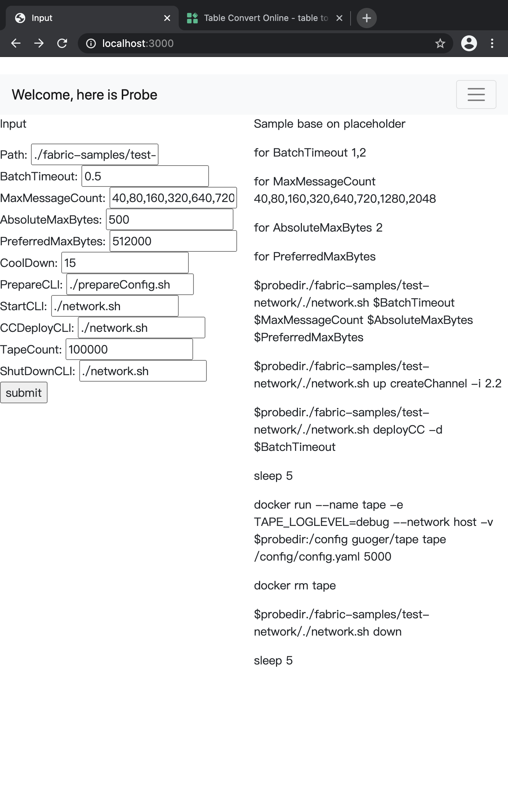
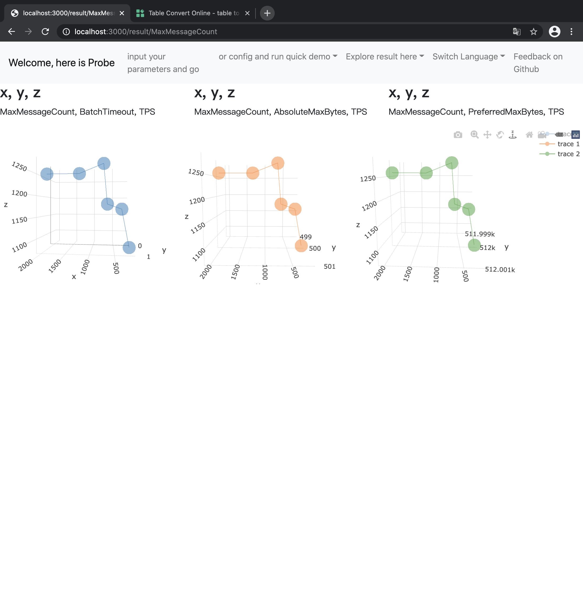
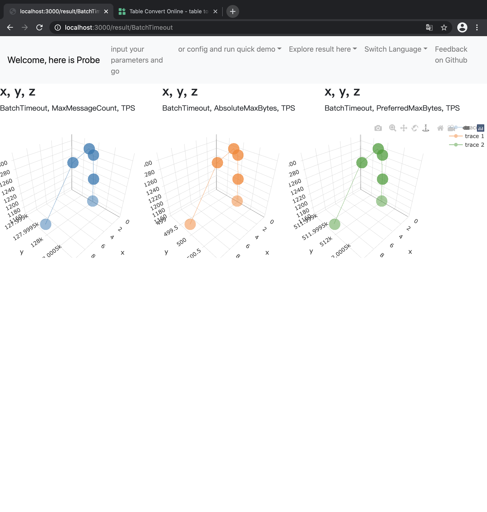

# How to config Fabric block related parameter to get “max” TPS
## Understanding those paramters
1st of all, we should know how those 4 parameters working together. 
As summary, Fabric seems will detect block match parameters in order of PreferredMaxBytes，AbsoluteMaxBytes，MaxMessageCount and BatchTimeout.
If matched any of them, then the block will be send out.

### Avoid using Batch timeout
In this trun, let's use Probe with parameter below to do a testing for Fabric test-network
```
BatchTimeout：20
MaxMessageCount：320
AbsoluteMaxBytes：20
PreferredMaxBytes：20480
```
Result: 
| Chaincode | BatchTimeout | MaxMessageCount | AbsoluteMaxBytes | PreferredMaxBytes | TPS         |
|-----------|--------------|-----------------|------------------|-------------------|-------------|
| sample    | 20           | 320             | 20               | 20480             | 414\.187180 |

From the tape log, we can see the last block takes about BatchTimeout duration and down the total tps.
```
Time     5.89s  Block     33    Tx    320
Time     5.98s  Block     34    Tx    320
Time     6.04s  Block     35    Tx    320
Time     6.09s  Block     36    Tx    320
Time    24.14s  Block     37    Tx     80
time="2020-12-11T09:27:48Z" level=info msg="Completed processing transactions."
tx: 10000, duration: 24.143673413s, tps: 414.187180
```
There for 
# Deduction one：We'd better to avoid orderer sending a new block by a too large Batchtimout.

## Relationship among PreferredMaxBytes，AbsoluteMaxBytes，MaxMessageCount
How PreferredMaxBytes，AbsoluteMaxBytes，MaxMessageCount working togther?
In this trun, we config probe as below:
```
BatchTimeout：20
MaxMessageCount：10,20,40
AbsoluteMaxBytes：20
PreferredMaxBytes：4
```
result：
| Chaincode | BatchTimeout | MaxMessageCount | AbsoluteMaxBytes | PreferredMaxBytes | TPS         |
|-----------|--------------|-----------------|------------------|-------------------|-------------|
| sample    | 20           | 10              | 20               | 4                 | 156\.155258 |
| sample    | 20           | 20              | 20               | 4                 | 156\.811844 |
| sample    | 20           | 40              | 20               | 4                 | 157\.936309 |

From tape log, there alway 1 tx in block as PreferredMaxBytes is 4 kb.
```
Time    63.75s  Block  10000    Tx      1
Time    63.75s  Block  10001    Tx      1
Time    63.76s  Block  10002    Tx      1
Time    63.76s  Block  10003    Tx      1
Time    63.77s  Block  10004    Tx      1
Time    63.77s  Block  10005    Tx      1
time="2020-12-11T09:43:16Z" level=info msg="Completed processing transactions."
tx: 10000, duration: 1m3.770693352s, tps: 156.811844
```
Suppose PreferredMaxBytes for 4 kb only support for 1 tx in block.
Start a new trun
```
BatchTimeout：20
MaxMessageCount：320，640
AbsoluteMaxBytes：20
PreferredMaxBytes：512
```
tape log(512k / 135 tx = 3.8k/block) meets the suppose above.
```
Time     6.33s  Block     67    Tx    135
Time     6.37s  Block     68    Tx    135
Time     6.39s  Block     69    Tx    135
Time     6.43s  Block     70    Tx    135
Time     6.48s  Block     71    Tx    135
Time     6.51s  Block     72    Tx    135
Time     6.56s  Block     73    Tx    135
Time     6.59s  Block     74    Tx    135
Time     6.62s  Block     75    Tx    135
Time     6.67s  Block     76    Tx    135
Time     6.70s  Block     77    Tx    135
Time     6.75s  Block     78    Tx    135
Time     6.78s  Block     79    Tx    135
```

# Deduction Two： With constant tx size(kb), how many txs inside a block can be see as min value among PreferredMaxBytes/tx size，MaxMessageCount， AbsoluteMaxBytes/tx size

## Fabric Max TPS value?
### Hardware
For any Fabric network building on hardware, we can't over hardware limiation, such as kb/s from disk io/network device io.

### Parameter failure
To get the max tsp, in fact, what we are going to do, is to make those parameters failure.
A short mathematical provement below:

#### Mathematical
From Deduction two, we can get that
```
block size = min(PreferredMaxBytes，MaxMessageCount * tx size， AbsoluteMaxBytes)
```
or：
```
tx size = min(PreferredMaxBytes / tx size，MaxMessageCount， AbsoluteMaxBytes / tx size)
```
# Deduction three： Fabric TPS，can show as kb/s or tx/s：
```
tps(kb/s) = min(PreferredMaxBytes，MaxMessageCount * tx size， AbsoluteMaxBytes)/batchtimout
```
or
```
tps = min(PreferredMaxBytes / tx size，MaxMessageCount， AbsoluteMaxBytes / tx size)/batchtimout
```

## How to make it
From business considering, we used to limit BatchTimeout or MaxMessageCount.
Ex: 
### Base on BatchTimeout
At same BatchTimeout，adjust MaxMessageCount，with function
```
tps = min(PreferredMaxBytes / tx size，MaxMessageCount， AbsoluteMaxBytes / tx size)/batchtimout
```
adjust MaxMessageCount to rich hardware limiation.
here is the config fro probe

result：
| Chaincode | BatchTimeout | MaxMessageCount | AbsoluteMaxBytes | PreferredMaxBytes | TPS          | calculation tps |
|-----------|--------------|-----------------|------------------|-------------------|--------------|--------------|
| sample    | 0\.5         | 40              | 500              | 512000            | 853\.662773  | 80 |
| sample    | 0\.5         | 160             | 500              | 512000            | 1073\.833629 | 320 |
| sample    | 0\.5         | 320             | 500              | 512000            | 1168\.482934 | 640 |
| sample    | 0\.5         | 640             | 500              | 512000            | 1180\.903770 | 720 |
| sample    | 0\.5         | 720             | 500              | 512000            | 1282\.712621 | 1440 |
| sample    | 0\.5         | 1280            | 500              | 512000            | 1258\.385389 | 20480 |
| sample    | 0\.5         | 2048            | 500              | 512000            | 1258\.623620 | 4096 |


### Base on MaxMessageCount
With same MaxMessageCount，adjust BatchTimeout，base
```
tps = min(PreferredMaxBytes / tx size，MaxMessageCount， AbsoluteMaxBytes / tx size)/batchtimout
```

Result:
| Chaincode | BatchTimeout | MaxMessageCount | AbsoluteMaxBytes | PreferredMaxBytes | TPS          |
|-----------|--------------|-----------------|------------------|-------------------|--------------|
| sample    | 0\.2         | 128000          | 500              | 512000            | 1156\.604634 | 
| sample    | 0\.5         | 128000          | 500              | 512000            | 1227\.426704 |
| sample    | 1            | 128000          | 500              | 512000            | 1291\.886710 |
| sample    | 2            | 128000          | 500              | 512000            | 1310\.490079 |
| sample    | 5            | 128000          | 500              | 512000            | 1295\.549652 |
| sample    | 10           | 128000          | 500              | 512000            | 1184\.683782 |


#### Appendix
this document basing on[Probe](https://github.com/SamYuan1990/Probe)，[Tape](https://github.com/ghcr.io/hyperledger-twgc/tape) and [test-network](https://github.com/hyperledger/fabric-samples)，using fabric 2.2 image，on my Max laptop.
