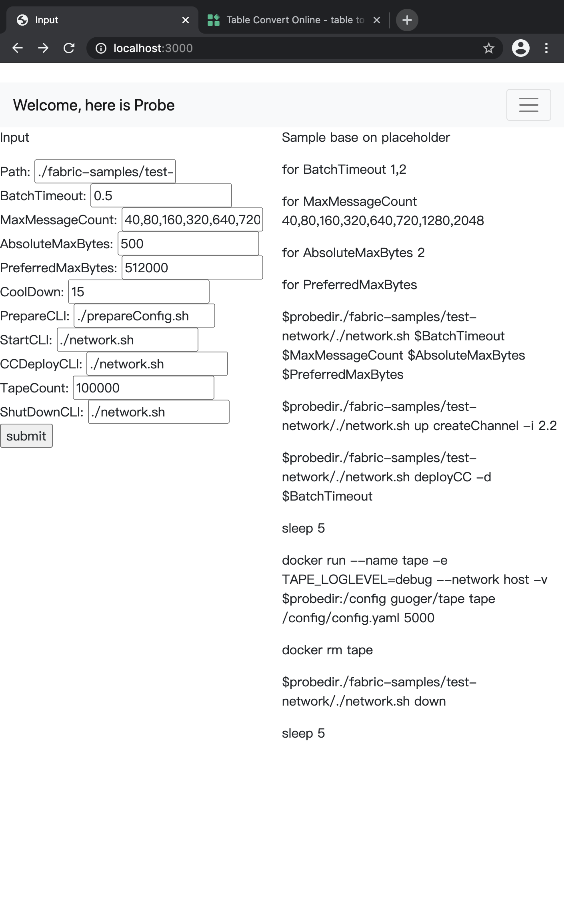

# 如何配置Fabric出块参数来达到“最大”TPS
## 对于参数的了解
在讨论有关最大tps的问题之前，我们首先要了解Fabric出块的四个参数之间是如何工作的。
从结论上，Fabric会优先于PreferredMaxBytes，AbsoluteMaxBytes，MaxMessageCount这三个参数，最后是BatchTimeout。
### 避免落入batch timeout
我们以如下配置Probe发起对于Fabric的性能测试。
```
BatchTimeout：20
MaxMessageCount：320
AbsoluteMaxBytes：20
PreferredMaxBytes：20480
```
得到结果如下：
| Chaincode | BatchTimeout | MaxMessageCount | AbsoluteMaxBytes | PreferredMaxBytes | TPS         |
|-----------|--------------|-----------------|------------------|-------------------|-------------|
| sample    | 20           | 320             | 20               | 20480             | 414\.187180 |

从tape的log中，我们可以发现最后一个块实际上很大程度的影响了fabric的tps。
```
Time     5.89s  Block     33    Tx    320
Time     5.98s  Block     34    Tx    320
Time     6.04s  Block     35    Tx    320
Time     6.09s  Block     36    Tx    320
Time    24.14s  Block     37    Tx     80
time="2020-12-11T09:27:48Z" level=info msg="Completed processing transactions."
tx: 10000, duration: 24.143673413s, tps: 414.187180
```
因此，这个发现表明，
# 推论一：我们最好不要依赖一个过大的batchtimeout值来触发fabric出块。

## PreferredMaxBytes，AbsoluteMaxBytes，MaxMessageCount的关系
那么，PreferredMaxBytes，AbsoluteMaxBytes，MaxMessageCount三个参数之间如何相互影响？
我们以如下配置Probe发起对于Fabric的性能测试。
```
BatchTimeout：20
MaxMessageCount：10,20,40
AbsoluteMaxBytes：20
PreferredMaxBytes：4
```
得到结果如下：
| Chaincode | BatchTimeout | MaxMessageCount | AbsoluteMaxBytes | PreferredMaxBytes | TPS         |
|-----------|--------------|-----------------|------------------|-------------------|-------------|
| sample    | 20           | 10              | 20               | 4                 | 156\.155258 |
| sample    | 20           | 20              | 20               | 4                 | 156\.811844 |
| sample    | 20           | 40              | 20               | 4                 | 157\.936309 |

从tape的log中，我们可以发现无论如何配置MaxMessageCount，我们的块中永远只有1笔交易。
```
Time    63.75s  Block  10000    Tx      1
Time    63.75s  Block  10001    Tx      1
Time    63.76s  Block  10002    Tx      1
Time    63.76s  Block  10003    Tx      1
Time    63.77s  Block  10004    Tx      1
Time    63.77s  Block  10005    Tx      1
time="2020-12-11T09:43:16Z" level=info msg="Completed processing transactions."
tx: 10000, duration: 1m3.770693352s, tps: 156.811844
```
4k大小的PreferredMaxBytes在测试中只能支持一个1tx
基于我们的测试，一笔交易的大小约为4kb。因此我们调整PreferredMaxBytes并且再次观察。
```
BatchTimeout：20
MaxMessageCount：320，640
AbsoluteMaxBytes：20
PreferredMaxBytes：512
```
tape log(512k 约等于 135 tx，即3.8k/block)
```
Time     6.33s  Block     67    Tx    135
Time     6.37s  Block     68    Tx    135
Time     6.39s  Block     69    Tx    135
Time     6.43s  Block     70    Tx    135
Time     6.48s  Block     71    Tx    135
Time     6.51s  Block     72    Tx    135
Time     6.56s  Block     73    Tx    135
Time     6.59s  Block     74    Tx    135
Time     6.62s  Block     75    Tx    135
Time     6.67s  Block     76    Tx    135
Time     6.70s  Block     77    Tx    135
Time     6.75s  Block     78    Tx    135
Time     6.78s  Block     79    Tx    135
```
符合预期，因此我们可以简单的得出一个推论，这三个参数实际上都是限制block中有多少笔交易的参数。

# 推论二：在tx大小恒定的情况下。（或者我们可以以均值取代等方式）块内交易数目为PreferredMaxBytes/tx size，MaxMessageCount， AbsoluteMaxBytes/tx size中的最小值。

## Fabric TPS的上限是什么？
### 硬件上限
我们说任何性能的理论上限是整个网络的上限，也就是整组设备中某个设备I/O，或其他的最小值。
也就是说，无论我们如何优化这四个参数，我们也无法将fabric的tps上限超过网络中某块网卡的最大承载能力。

### 参数失效
因此，为了追求最大的TPS我们需要尽可能的让Fabric某些控制参数失效。来达到这一目的，数学证明如下：

#### 数学表达
从上文中我们将PreferredMaxBytes，AbsoluteMaxBytes，MaxMessageCount视为控制一个块内有多少交易。
即：
```
block size = min(PreferredMaxBytes，MaxMessageCount * tx size， AbsoluteMaxBytes)
```
或：
```
tx size = min(PreferredMaxBytes / tx size，MaxMessageCount， AbsoluteMaxBytes / tx size)
```

# 推论三： Fabric网络的TPS，可以表达为kb/s或者tx/s，如下：
```
tps(kb/s) = min(PreferredMaxBytes，MaxMessageCount * tx size， AbsoluteMaxBytes)/batchtimout
```
或者
```
tps = min(PreferredMaxBytes / tx size，MaxMessageCount， AbsoluteMaxBytes / tx size)/batchtimout
```

## 如何实现
现实上来说，业务一般会限制BatchTimeout或者MaxMessageCount。或者我们可以从这两个参数入手。
在如下示例中，
### 基于BatchTimeout
在同样的BatchTimeout下，调整MaxMessageCount，基于
```
tps = min(PreferredMaxBytes / tx size，MaxMessageCount， AbsoluteMaxBytes / tx size)/batchtimout
```
不断的调整MaxMessageCount直到上限。
我们以如下 来配置Probe发起对于Fabric的性能测试。

得到结果如下：
| Chaincode | BatchTimeout | MaxMessageCount | AbsoluteMaxBytes | PreferredMaxBytes | TPS          | calculation tps |
|-----------|--------------|-----------------|------------------|-------------------|--------------|--------------|
| sample    | 0\.5         | 40              | 500              | 512000            | 853\.662773  | 80 |
| sample    | 0\.5         | 160             | 500              | 512000            | 1073\.833629 | 320 |
| sample    | 0\.5         | 320             | 500              | 512000            | 1168\.482934 | 640 |
| sample    | 0\.5         | 640             | 500              | 512000            | 1180\.903770 | 720 |
| sample    | 0\.5         | 720             | 500              | 512000            | 1282\.712621 | 1440 |
| sample    | 0\.5         | 1280            | 500              | 512000            | 1258\.385389 | 20480 |
| sample    | 0\.5         | 2048            | 500              | 512000            | 1258\.623620 | 4096 |


### 基于MaxMessageCount
在同样的MaxMessageCount下，调整BatchTimeout，基于
```
tps = min(PreferredMaxBytes / tx size，MaxMessageCount， AbsoluteMaxBytes / tx size)/batchtimout
```
不断的调整BatchTimeout直到上限。
我们以如下 来配置Probe发起对于Fabric的性能测试。
得到结果如下：
| Chaincode | BatchTimeout | MaxMessageCount | AbsoluteMaxBytes | PreferredMaxBytes | TPS          |
|-----------|--------------|-----------------|------------------|-------------------|--------------|
| sample    | 0\.2         | 128000          | 500              | 512000            | 1156\.604634 |
| sample    | 0\.5         | 128000          | 500              | 512000            | 1227\.426704 |
| sample    | 1            | 128000          | 500              | 512000            | 1291\.886710 |
| sample    | 2            | 128000          | 500              | 512000            | 1310\.490079 |
| sample    | 5            | 128000          | 500              | 512000            | 1295\.549652 |
| sample    | 10           | 128000          | 500              | 512000            | 1184\.683782 |


#### 后记
本文基于[Probe](https://github.com/SamYuan1990/Probe)，[Tape](https://github.com/guoger/tape)以及[test-network](https://github.com/hyperledger/fabric-samples)，基于fabric 2.2版本image，在mac上单机进行的测试。
